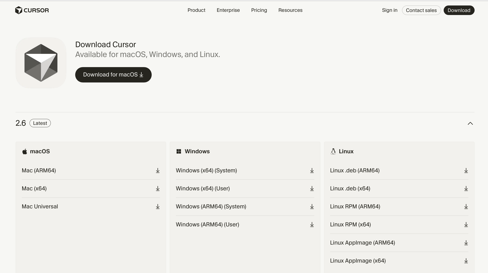

# Setup
{: .no_toc }

{:toc}

Before workshops **2** and **3**, work through the sections below. You will use **Cursor** for AI-assisted coding and **Python** (**pandas**, **matplotlib**) for the code examples.

---

## At a glance

| Check | Item |
|-------|------|
| ☑ | **Python 3.11+** with packages **pandas** and **matplotlib** |
| ☑ | **Cursor** installed (free tier is fine) |
| ☑ | **Palmer Penguins** CSV saved as `data/penguins.csv` in your project (see **Data** below) |

---

## What you need

### Python

**Stack:** Python **3.11 or newer**, plus **pandas** (tables) and **matplotlib** (plots). No virtual environment is required unless your school or workplace asks for one.

**Install Python**

1. Download from **[python.org/downloads](https://www.python.org/downloads/)** (Windows, macOS, or Linux).
2. *Windows:* turn on **Add Python to PATH** if the installer offers it.
3. *macOS (optional):* `brew install python` with Homebrew works too.

**Check that Python runs**

Open a terminal and run:

```bash
python3 --version
```

If that fails, try `python --version`. You want **3.11+**.

**Install workshop packages**

```bash
pip install pandas matplotlib
```

If `pip` is not found, try `pip3` or:

```bash
python3 -m pip install pandas matplotlib
```

**Sanity check (optional)**

```bash
python3 -c "import pandas, matplotlib; print('OK:', pandas.__version__)"
```

**Optional — Jupyter (`.ipynb`)**

For notebook-based demos, install when you need it:

```bash
pip install notebook
```

Then run `jupyter notebook` or open `.ipynb` files in Cursor. Skip this if you only run `.py` files.

---

### Cursor



1. Download **[cursor.com](https://cursor.com)** → choose your OS → install.
2. Open Cursor and **sign in**.
3. Open Chat: **`Cmd+L`** (Mac) or **`Ctrl+L`** (Windows / Linux).

---

### Data — Palmer Penguins dataset

Preview of the data we'll work with:

| species | island | bill_length_mm | bill_depth_mm | flipper_length_mm | body_mass_g | sex | year |
|---------|--------|----------------|---------------|-------------------|-------------|-----|------|
| Adelie | Torgersen | 39.1 | 18.7 | 181 | 3750 | male | 2007 |
| Adelie | Torgersen | 39.5 | 17.4 | 186 | 3800 | female | 2007 |
| Adelie | Torgersen | 40.3 | 18.0 | 195 | 3250 | female | 2007 |
| Chinstrap | Dream | 46.5 | 17.9 | 192 | 3500 | female | 2007 |
| Gentoo | Biscoe | 46.1 | 13.2 | 211 | 4500 | female | 2007 |

**344 rows × 8 columns**


**[Download dataset (CSV)](../data/penguins.csv)**

**Source:** [Palmer Penguins](https://allisonhorst.github.io/palmerpenguins/)  

**Artwork:** [Illustrations](https://allisonhorst.github.io/palmerpenguins/articles/art.html) by [@allison_horst](https://twitter.com/allison_horst)

Put `penguins.csv` in your project so paths match the workshops (e.g. `data/penguins.csv` next to your scripts or notebook).

---

## Quick start workshops

1. **[Workshop 1: Fundamentals](workshops/01_fundamentals.md)** — ~30 min  
2. **[Workshop 2: Data analysis & visualization](workshops/02_data_analysis_visualization.md)**  
3. **[Workshop 3: Building with AI](workshops/03_building_with_ai.md)**

Workshops build on each other, but you can change the order if you prefer.
