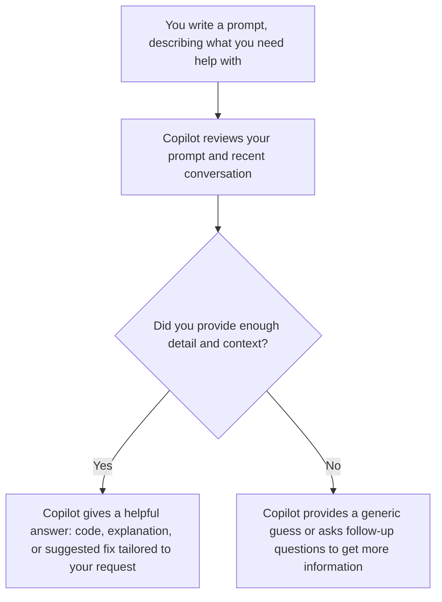

---

## layout: default
title: Part 1. Concepts and Context 
parent: Workshops
nav_order: 1

# Part 1. Concepts and Context

Learning introductory concepts and context for AI-assisted coding.

**Duration:** 30 min

---

## Learning Objectives

By the end of this workshop, you will:

- Have a conceptual understanding of how LLMs work
- Learn how to write clear intelligible prompts that AI tools respond to best 
- Understand the privacy risks inherent in LLMs like Copilot

---

## Behind the Scenes: How LLMs Work

Large language models (LLMs) are trained on massive amounts of public code and documentation. This means they're skilled at recognizing syntax, identifying common programming patterns, and suggesting relevant fixes.

Before getting the most out of AI-assisted coding, it’s important to understand how the underlying models work. LLMs, like those powering Copilot, process text by breaking it down into **tokens** — small pieces of text, which could be a few letters, a single character, or a part of a word.

> **For example:**  
> The word `indivisible` might be tokenized into `ind`, `iv`, `isible` rather than as one whole unit. The model learns and responds to patterns built from these tokens.
> {: .note }

> **Context window:** Copilot can only pay attention to a limited chunk of text at any one time — this includes your current prompt, recent chat history, and whatever code or files you explicitly share. Think of it like a sticky note: if you add too much, older details may fall off and be forgotten.
> {: .note }

Every time you interact with Copilot or any AI tool, it starts from whatever info you provide *that session*.

**What this means in practice:**

- LLMs learned general coding patterns from huge amounts of **public** code and documentation online.
- Every time you use Copilot, the model works from **what you share** in that moment — not your entire project by default.
- **Better context → better answers.** Vague or missing context → generic or incomplete outputs.




---

## The Prompt Formula

When you want help from AI for code or data, a clear prompt really helps. Try using this structure in your requests:

```
Context: What data or code are you working with?
Task: What do you want to accomplish?
Constraints: Any specific tools, libraries, or limits?
Format: How should the AI present the answer?
```

A handy way to remember: **Context + Task + Constraints + Format**

### Example 1: Vague vs. Clear

**Less helpful:**  

> "Tell me about my research data." 

Example chat with Copilot.

**Much better:**  

> "I have a CSV file with penguins data. How many columns does it have? Show me the column names as a list."


| Prompt Part | What’s included in the improved example |
| ----------- | --------------------------------------- |
| Context     | CSV file with penguins data             |
| Task        | Count columns, list column names        |
| Format      | Show the result as a list               |


### Example 2: Stating Your Tools (Constraints)

> "I have a `penguins.csv` dataset. Using the pandas library in Python, can you calculate the average ... (some metrics of interest)? Show the results as a table."

This example makes your request clear and specific by:

- Stating the tool you want to use (pandas library in Python).
- Naming the data file (`penguins.csv`).
- Defining exactly what to calculate (average flipper length by species).
- Requesting a specific output format (table).

---

## Data Privacy with LLMs

Data privacy is a major concern when using Large Language Models (LLMs) such as GitHub Copilot or ChatGPT. Anything you input—your code, prompts, or datasets—might be sent to and seen by the tool’s servers. For this reason, throughout this workshop, we are using non-confidential Penguins data for coding and analysis activities.

{: .warn}
**Only use [GitHub Copilot](https://github.com/features/copilot) with files that can be made public.** All files in a Copilot *workspace* may be indexed and shared with AI tools, even if you don't enter them into the chat. Never use GitHub Copilot with personal or confidential data.

More detail: [UBC AI guidance](../ubc_ai_policy.html).

---

## Key Takeaways

1. **LLMs work from patterns + your context** — they don't automatically see your whole project.
2. **Tokens and context limits matter** — be clear and include what Copilot needs in the current chat.
3. **Use the formula** — Context + Task + Constraints + Format beats vague requests.
4. **Only share public-safe data** — do not share confidential or personal information into AI tools.

---

## Resources

- [UBC AI guidance](../ubc_ai_policy.html)
- [GitHub Copilot Trust Center](https://resources.github.com/copilot-trust-center/)
- [Palmer Penguins dataset](https://allisonhorst.github.io/palmerpenguins/)

---

**Next:** [Part 2. Set Up GitHub Copilot](02_set_up_github_copilot.md)