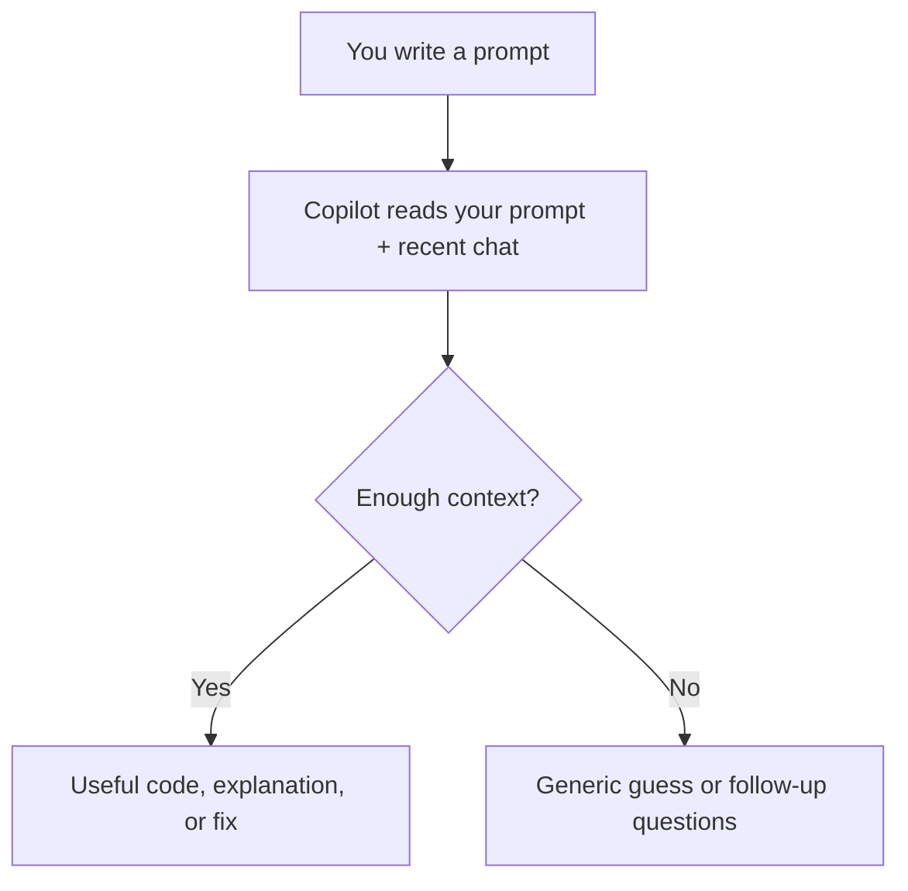

# Part 1. Concepts and Context 

Learning introductory concepts and context for AI-assisted coding.

**Duration:** 30 min

---

## Learning objectives

By the end of this workshop, you will know:

- Have a conceptual understanding of how LLMs work
- Learn how to write clear intelligible prompts that AI tools respond to best 
- Understand the privacy risks inherent in LLMs like Copilot 

---

## Behind the Scene

Large language models (LLM) learned general coding patterns from huge amounts of public code and documentation online. That means that AI models are good at recognizing common syntax, coding libraries, and typical fixes in programming languages.

Before getting the most out of AI-assisted coding, it’s important to understand how the underlying models work. LLMs, like those powering Copilot, process text by breaking it down into **tokens** — small pieces of text, which could be a few letters, a single character, or a part of a word.

**Example:** The word `indivisible` might be split into tokens like `ind`, `iv`, `isible` rather than just one whole unit. The model recognizes and learns from patterns in these tokens.

**Context window:** Copilot can only pay attention to a limited chunk of text at any one time — this includes your current prompt, recent chat history, and whatever code or files you explicitly share. Think of it like a sticky note: if you add too much, older details may fall off and be forgotten.

Each time you use an AI tool (such as Copilot), the model starts from what information you provide in that session.

```mermaid
flowchart LR
    A[Model learns<br/>from public code] --> B[(LLM)]
    C[You provide context<br/>(prompt, code, errors)] --> B
    B --> D[LLM uses what you share<br/>to generate answers]
    E[Your whole project] -.->|Not seen unless shared| B
```
# End of Selection
```

**What this means in practice:**

- LLMs learned general coding patterns from huge amounts of **public** code and documentation online.
- Every time you use Copilot, the model works from **what you share** in that moment — not your entire project by default.
- **Better context → better answers.** Vague or missing context → generic or incomplete outputs.



---

## The Prompt Formula

When asking AI to help with code or data, a clear prompt gives better results. Use this simple structure:

```
Context: What data or code are you working with?
Task: What do you want to do?
Constraints: Any rules, specific tools to be used, or limitations?
Format: How should the output answer look?
```

Remember it as: **Context + Task + Constraints + Format**

### Example 1: From vague to clear

**Less effective (too vague):**
> "Tell me about my research data."

**Much better:**
> "I have a CSV file with book data. How many columns does it have? Show me the column names as a list."

| Prompt Part | What’s included in the improved example               |
|-------------|------------------------------------------------------|
| Context     | There's a CSV file with reading study (book) data    |
| Task        | Count columns, list the column names                 |
| Format      | Show the result as a list                            |

### Example 2: Adding a tool (Constraints)

> "I have `book.csv`. Using pandas, show me the average pages read for each participant as a table."


---

## Data Privacy with LLMs: The Importance of Using Dummy Data

**Highlighting Our Third Learning Objective:**  
One of the biggest concerns when using Large Language Models (LLMs) like GitHub Copilot (or ChatGPT) is data privacy. Everything you share—code, prompts, even your data—could become available to the tool. In this part of the workshop, we'll see why it's safer and smarter to use non-private, dummy data for most coding and analysis exercises. You'll also learn simple ways to create your own dummy datasets, so you’ll feel confident and protected working on your own projects.

---

### What Happens to Data Shared with LLMs?

The major issue around privacy for LLMs is that they store and can incorporate your input into their model. This is why _sharing data with Copilot or any LLM is a decision you should make with great care._ Let’s look at two types of data:

**Confidential data**  
Patient records and Indigenous knowledge are examples of information that should **never** be uploaded to GitHub Copilot or any LLM. These types of data need to be protected, both where they’re stored (paper or digital) and in terms of who can access them. Uploading confidential material to LLMs exposes you (and others) to serious risks.

**Non-confidential data**  
Non-confidential data includes files or measurements you would likely publish anyway, such as water temperatures or reading test scores. These are _safer_, but even public data you upload to Copilot is fair game for others—there’s no guarantee you’ll get credit if your work winds up elsewhere.

---

### Dummy Data: A Safe, Practical Solution

#### Why dummy data?

Because of privacy and security, you **shouldn’t upload real data** to Copilot unless you’re absolutely sure it’s safe to share. But dummy (fake) data is perfect for experimenting, troubleshooting, and learning:
- Try out new code without worrying about leaks
- Practice analysis techniques safely
- Test your ideas and learn from mistakes—risk free

Experienced coders use dummy data all the time. It helps them see what results or errors to expect and builds confidence before working with real information.

#### What makes dummy data "good"?

The best dummy datasets are:
- **Small**—keep it quick to type and simple to understand
- **Obvious group differences**—so results and charts are easy to interpret
- **Structured like your real data**—same columns and data types as your real work
- **Similar kinds of values**—e.g., numeric, dates, categories, etc.

For example: If your actual book data has three groups measured over two days, just set up your dummy data the same way.

---

#### Creating Dummy Data: A Quick Example

Imagine your real research data tracks how many pages each student reads over two days.

Let’s make a tiny “dummy” table with the right columns (`participant_id`, `day`, `pages_read`) and some realistic numbers:

| participant_id | day | pages_read |
|----------------|-----|-----------|
| 1              | 1   | 20        |
| 2              | 1   | 15        |
| 3              | 1   | 22        |
| 1              | 2   | 45        |
| 2              | 2   | 37        |
| 3              | 2   | 41        |

---

#### Using Dummy Data in Copilot

Just copy this mini table and paste it into Copilot. You can ask for summary statistics, test your code, or explore data analysis steps—completely safely, with no risk of leaking personal or unpublished information.  
*(Tip: Since this is just a table, not a CSV file, you can paste it in directly and experiment. No need to upload files.)*

> Using dummy data is an ethical and professional best practice. It protects you, your research subjects, and your institution.

---

**In summary:**  
There’s always a risk to sharing real data with Copilot or any LLM. By practicing with dummy data, you can experiment, learn, and solve problems completely safely. This is a standard approach for experienced developers—and something we highly recommend as you build your coding skills!

---

## Key Takeaways

1. **LLMs work from patterns + your context** — they don't automatically see your whole project.
2. **Tokens and context limits matter** — be clear and include what Copilot needs in the current chat.
3. **Use the formula** — Context + Task + Constraints + Format beats vague requests.
4. **Only share public-safe data** — never paste confidential or personal information into AI tools.

---

## Resources

- [Palmer Penguins dataset](https://allisonhorst.github.io/palmerpenguins/)
- [UBC AI guidance](../ubc_ai_policy.html)
- [GitHub Copilot Trust Center](https://resources.github.com/copilot-trust-center/)
- [Making Dummy Data (Workshop Resource)](https://ubc-library-rc.github.io/AI_for_coding_2025/content/3_dummy_data.html)

---

**Next:** [Part 2. Set Up GitHub Copilot](02_set_up_github_copilot.md)
