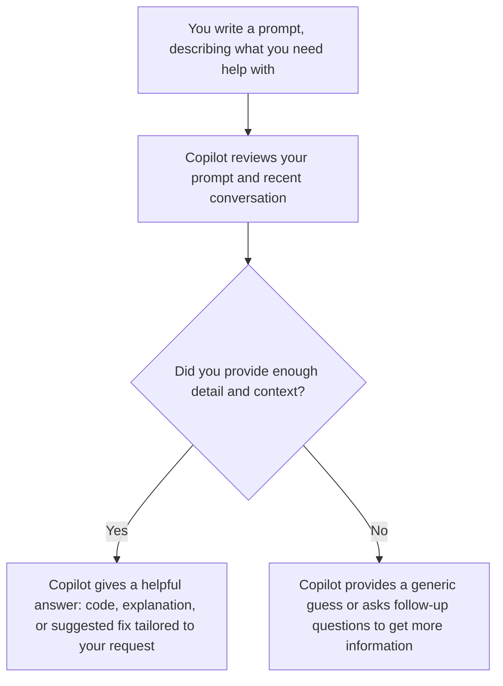
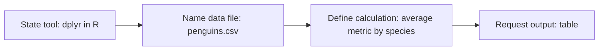

# Part 1. Concepts and Context

Learning introductory concepts and context for AI-assisted coding.

---

## Learning Objectives

By the end of this workshop, you will:

- Have a conceptual understanding of how LLMs work
- Learn how to write intelligible prompts that AI tools respond to best
- Understand the privacy risks inherent in LLMs like Copilot

---

## Behind the Scenes: How LLMs Work

Large language models (LLMs) are trained on massive amounts of public code and documentation. This means they're skilled at recognizing syntax, identifying common programming patterns, and suggesting relevant fixes.

Before getting the most out of AI-assisted coding, it’s important to understand how the underlying models work. LLMs, like those powering Copilot, don't understand language the way humans do. While we read text as **words with meaning**, the model breaks the same text into **tokens** — small chunks that may be whole words, parts of words, or even single characters. Tokens are the model's real unit of work: they determine how much it can "remember" at once and how much usage costs.

Every time you interact with Copilot or any AI tool, it starts from whatever info you provide *that session*.

**What this means in practice:**

- LLMs have already memorized general coding patterns from huge amounts of **public** code and documentation online.
- They use these patterns to predict what your request may be about. The more precise your question is, the more pertinent the resopnse will be.
- Every time you use Copilot, the model works from **what you share** in that moment — not your entire project by default.

In a nutshell:
- **Better context → better answers.** 
- Vague or missing context → generic or incomplete outputs.

## The context window

AI agents can only "remember" a limited amount of text at once (your prompt, recent chat, and shared files). The examples we use in this workshop stay well within that limit. However, keep this in mind once you move on to larger projects, as the context of your work may become opaque for the AI agent after a while.

## The Prompt Formula

The quality of the model's response depends heavily on the way we prompt it. A well-structured prompt gives the model the context it needs to be genuinely useful — instead of making vague guesses. Therefore, when asking for help with code or data, try framing your request around these four elements:

| **Context** | What data or code are you working with?
| **Task** | What do you want to accomplish?
| **Constraints** | Do you need any specific tools, libraries, or limitations?
| **Format** | How should the AI present and structure the answer?

### Example 1: Vague vs. Clear

A relatively vague prompt is **less helpful.** For example:  

> "Tell me about my research data on penguins."

Notice how the AI response to this prompt is vague and generic.

Clarity and specificity tends to produce **more helpful** responses:  

> "I have a CSV file with penguins data. How many columns does it have? Show me the column names as a list."

Notice the difference: this version names the **context** (a CSV file), a specific **task** (count the columns), and the **format** (a list). It is more likely to get a precise answer instead of a generic one.

### Example 2: Stating Your Tools (Constraints)

> "I have a `penguins.csv` dataset. Calculate the average... (some metrics of interest) using the dplyr package in R. Show the results as a table."

This example makes your request clear and specific.

| Prompt Component | Sample |
| :--- | :--- |
| **Context** | *"I have a `penguins.csv` dataset..."* |
| **Task** | *"...calculate the average ... by species..."* |
| **Constraints** | *"...using the dplyr package in R..."* |
| **Format** | *"...and show the result as a table"* |

---

## Data Privacy with LLMs

Data privacy is an important consideration when working with Large Language Models (LLMs) and similar AI tools. Any information you provide—such as code, prompts, or datasets—may be transmitted to external servers and viewed or processed by the tool provider.

For this reason, throughout these workshops we use only the public, non-confidential, demonstrative dataset for the coding and analysis activities in [Part 3](03_explore_prompt_and_build_with_github_copilot.md).

---

## Additional Resources

- [UBC AI guidance](../ubc_ai_policy.html)
- [GitHub Copilot Trust Center](https://resources.github.com/copilot-trust-center/)
- [Models and pricing for GitHub Copilot](https://docs.github.com/en/copilot/reference/copilot-billing/models-and-pricing)
- [Palmer Penguins dataset](https://allisonhorst.github.io/palmerpenguins/)

---

**Next:** [Part 2. Set Up GitHub Copilot](02_set_up_github_copilot.md)

