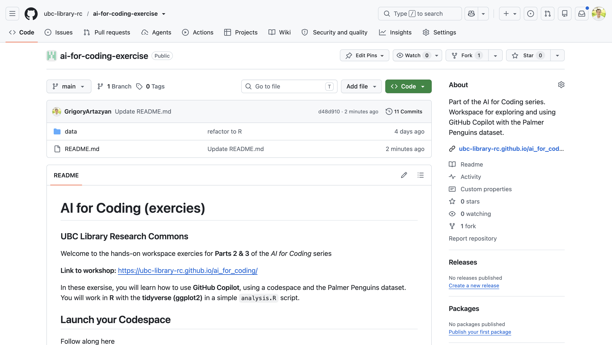
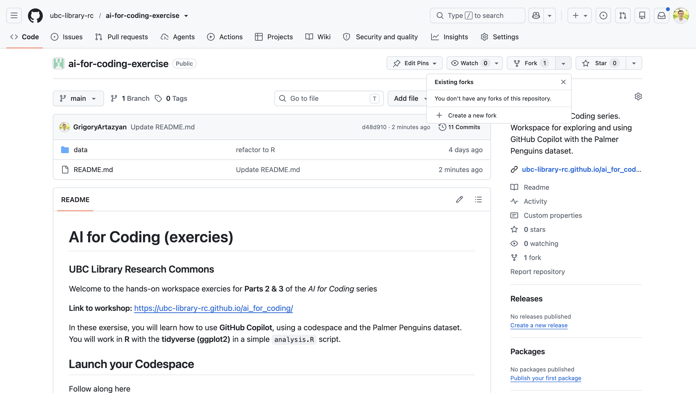
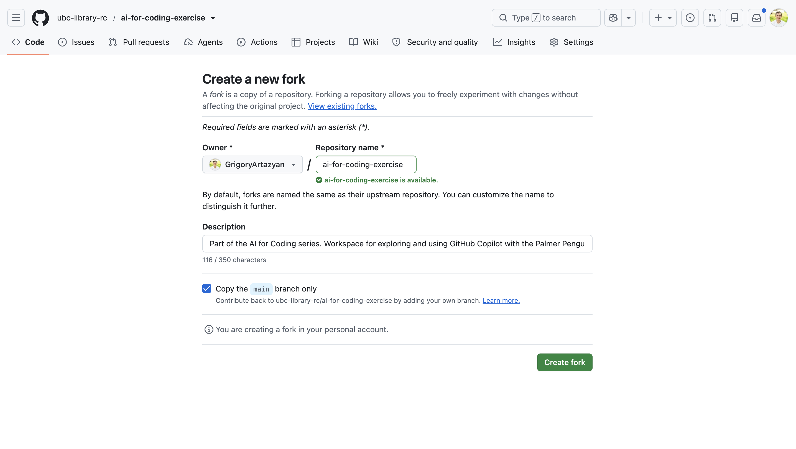
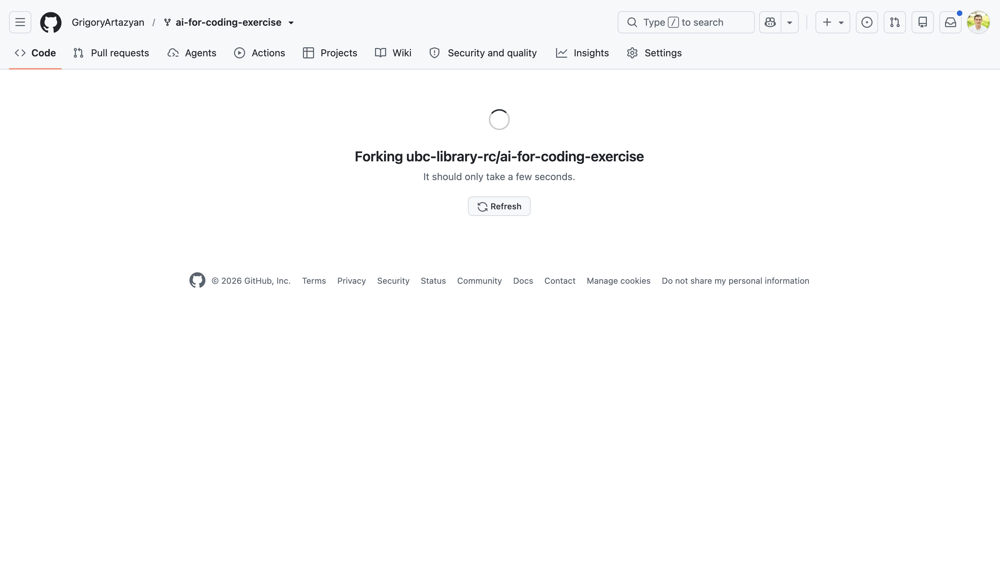
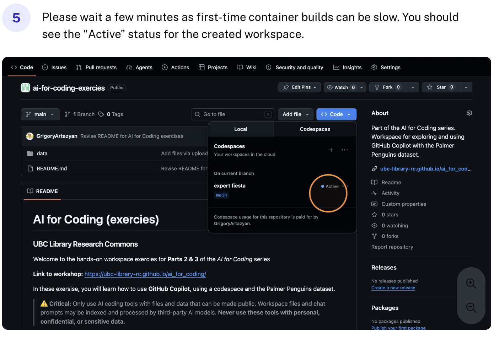
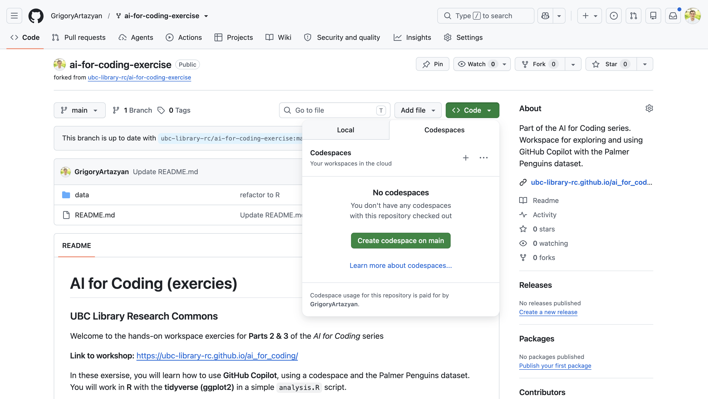

# Part 2. Set Up GitHub Copilot

Creating AI working environment with Copilot

**Duration:** 30 min | **Tools:** GitHub Codespaces, Copilot, Python, pandas, matplotlib

{: .warn}
**Only use [GitHub Copilot](https://github.com/features/copilot) with files that can be made public.** All files in a Copilot _workspace_ may be indexed and shared with AI tools, even if you don't enter them into the chat. Never use GitHub Copilot with personal or confidential data.

More detail: [UBC AI guidance](../ubc_ai_policy.html).

---

## Learning objectives

By the end of this workshop, you will:

- Launch a GitHub Codespace for the workshop exercises
- Familiarize yourself with GitHub Copilot setup and working environment
- Maintain an active, lead role when engaging with AI tools
---

## Launch your Codespace

Follow the steps below to open the exercises repository in a browser-based coding environment. Use the arrows or scroll sideways inside the frame.

<div class="step-carousel" id="codespace-walkthrough" aria-label="Codespace setup walkthrough">
  <div class="step-carousel__toolbar">
    <span class="step-carousel__counter">Step <span data-current>1</span> of <span data-total>6</span></span>
    <div class="step-carousel__controls">
      <button type="button" class="step-carousel__btn" data-prev aria-label="Previous step">&#8592;</button>
      <button type="button" class="step-carousel__btn" data-next aria-label="Next step">&#8594;</button>
    </div>
  </div>

  <div class="step-carousel__viewport" tabindex="0">
    <div class="step-carousel__track">
      <article class="step-carousel__slide">
        <div class="step-carousel__media">
          
        </div>
        <div class="step-carousel__caption">
          <h4>Step 1: Open the Repository</h4>
          <p>Go to <a href="https://github.com/ubc-library-rc/ai-for-coding-exercies" target="_blank">github.com/ubc-library-rc/ai-for-coding-exercies</a> and sign in with your GitHub account.</p>
        </div>
      </article>
      <article class="step-carousel__slide">
        <div class="step-carousel__media">
          
        </div>
        <div class="step-carousel__caption">
          <h4>Step 2: Click Code</h4>
          <p>Click the green <strong>Code</strong> button near the top right of the repository page.</p>
        </div>
      </article>
      <article class="step-carousel__slide">
        <div class="step-carousel__media">
          
        </div>
        <div class="step-carousel__caption">
          <h4>Step 3: Open Codespaces Tab</h4>
          <p>Switch to the <strong>Codespaces</strong> tab in the menu that appears.</p>
        </div>
      </article>
      <article class="step-carousel__slide">
        <div class="step-carousel__media">
          
        </div>
        <div class="step-carousel__caption">
          <h4>Step 4: Create Codespace</h4>
          <p>Click <strong>Create codespace on main</strong> to launch a new Codespace.</p>
        </div>
      </article>
      <article class="step-carousel__slide">
        <div class="step-carousel__media">
          
        </div>
        <div class="step-carousel__caption">
          <h4>Step 5: Wait for Setup</h4>
          <p>Wait a few moments—first-time builds may take a minute or two. Your Codespace is ready when it shows "Active".</p>
        </div>
      </article>
      <article class="step-carousel__slide">
        <div class="step-carousel__media">
          
        </div>
        <div class="step-carousel__caption">
          <h4>Step 6: Start Coding!</h4>
          <p>You now have a full coding environment with Python, workshop libraries, and Copilot ready to go—directly in your browser.</p>
        </div>
      </article>
    </div>
  </div>

  <div class="step-carousel__dots" aria-hidden="true"></div>
</div>

<style>
.step-carousel {
  margin: 1rem 0 1.25rem;
  border: 1px solid #d8dee8;
  border-radius: 10px;
  background: #f8fafc;
  box-shadow: 0 2px 10px rgba(0, 0, 0, 0.06);
  overflow: hidden;
  max-width: 820px;
}
.step-carousel__toolbar {
  display: flex;
  align-items: center;
  justify-content: space-between;
  gap: 0.75rem;
  padding: 0.55rem 0.85rem;
  background: #fff;
  border-bottom: 1px solid #e3e8ef;
  font-size: 0.92rem;
  color: #4a5568;
}
.step-carousel__controls {
  display: flex;
  gap: 0.35rem;
}
.step-carousel__btn {
  width: 2rem;
  height: 2rem;
  border: 1px solid #c9d3e0;
  border-radius: 6px;
  background: #fff;
  color: #2d3748;
  cursor: pointer;
  line-height: 1;
  font-size: 1rem;
}
.step-carousel__btn:hover { background: #edf2f7; }
.step-carousel__btn:disabled {
  opacity: 0.45;
  cursor: not-allowed;
}
.step-carousel__viewport {
  overflow-x: auto;
  overflow-y: hidden;
  scroll-snap-type: x mandatory;
  scroll-behavior: smooth;
  -webkit-overflow-scrolling: touch;
  scrollbar-width: thin;
}
.step-carousel__track {
  display: flex;
  width: max-content;
}
.step-carousel__slide {
  flex: 0 0 100%;
  width: 100%;
  max-width: 820px;
  scroll-snap-align: start;
  display: grid;
  grid-template-columns: minmax(0, 1.2fr) minmax(0, 1fr);
  gap: 0.75rem;
  padding: 0.85rem;
  box-sizing: border-box;
  min-height: 260px;
}
.step-carousel__media {
  display: flex;
  align-items: center;
  justify-content: center;
  background: #fff;
  border: 1px solid #e3e8ef;
  border-radius: 8px;
  padding: 0.35rem;
  min-height: 0;
}
.step-carousel__media img {
  display: block;
  width: 100%;
  max-height: 220px;
  object-fit: contain;
  border-radius: 4px;
}
.step-carousel__caption {
  display: flex;
  flex-direction: column;
  justify-content: center;
  padding: 0.25rem 0.35rem;
}
.step-carousel__caption h4 {
  margin: 0 0 0.45rem;
  font-size: 1rem;
  color: #1a202c;
}
.step-carousel__caption p {
  margin: 0;
  font-size: 0.92rem;
  line-height: 1.45;
  color: #4a5568;
}
.step-carousel__dots {
  display: flex;
  justify-content: center;
  gap: 0.4rem;
  padding: 0.55rem 0.85rem 0.75rem;
  background: #fff;
  border-top: 1px solid #e3e8ef;
}
.step-carousel__dot {
  width: 8px;
  height: 8px;
  border-radius: 999px;
  border: none;
  padding: 0;
  background: #cbd5e0;
  cursor: pointer;
}
.step-carousel__dot.is-active { background: #2b6cb0; }
@media (max-width: 720px) {
  .step-carousel__slide {
    grid-template-columns: 1fr;
    min-height: auto;
  }
  .step-carousel__media img { max-height: 180px; }
}
</style>

<script>
(function () {
  var root = document.getElementById("codespace-walkthrough");
  if (!root) return;

  var viewport = root.querySelector(".step-carousel__viewport");
  var track = root.querySelector(".step-carousel__track");
  var slides = Array.prototype.slice.call(root.querySelectorAll(".step-carousel__slide"));
  var prevBtn = root.querySelector("[data-prev]");
  var nextBtn = root.querySelector("[data-next]");
  var currentEl = root.querySelector("[data-current]");
  var totalEl = root.querySelector("[data-total]");
  var dotsWrap = root.querySelector(".step-carousel__dots");
  var index = 0;

  totalEl.textContent = String(slides.length);

  slides.forEach(function (_, i) {
    var dot = document.createElement("button");
    dot.type = "button";
    dot.className = "step-carousel__dot" + (i === 0 ? " is-active" : "");
    dot.setAttribute("aria-label", "Go to step " + (i + 1));
    dot.addEventListener("click", function () { goTo(i); });
    dotsWrap.appendChild(dot);
  });

  var dots = Array.prototype.slice.call(root.querySelectorAll(".step-carousel__dot"));

  function goTo(i) {
    index = Math.max(0, Math.min(slides.length - 1, i));
    viewport.scrollLeft = slides[index].offsetLeft;
    currentEl.textContent = String(index + 1);
    prevBtn.disabled = index === 0;
    nextBtn.disabled = index === slides.length - 1;
    dots.forEach(function (dot, j) {
      dot.classList.toggle("is-active", j === index);
    });
  }

  prevBtn.addEventListener("click", function () { goTo(index - 1); });
  nextBtn.addEventListener("click", function () { goTo(index + 1); });

  viewport.addEventListener("scroll", function () {
    var width = viewport.clientWidth || 1;
    var nextIndex = Math.round(viewport.scrollLeft / width);
    if (nextIndex !== index) {
      index = nextIndex;
      currentEl.textContent = String(index + 1);
      prevBtn.disabled = index === 0;
      nextBtn.disabled = index === slides.length - 1;
      dots.forEach(function (dot, j) {
        dot.classList.toggle("is-active", j === index);
      });
    }
  }, { passive: true });

  goTo(0);
})();
</script>

Your Codespace opens in the browser as a full coding environment. Python, the workshop libraries, and GitHub Copilot are already installed for you—thanks to a special configuration file called `.devcontainer` that ensures everything is set up automatically (we'll explain more about this later). There's nothing else you need to set up!

{: .note}
Your Codespace is given an automatically generated name, so it won't match the examples. To reopen it later, go to [github.com/codespaces](https://github.com/codespaces) and click your Codespace's name.

---

## Palmer Penguins dataset

We'll use the Palmer Penguins dataset throughout the workshop. It's already included in your Codespace at `data/penguins.csv` — no download needed. (If you're working outside a Codespace, you can [download penguins.csv](../../data/penguins.csv) and save it in a `data` folder.)

Preview of the data we'll work with:

| species | island | bill_length_mm | bill_depth_mm | flipper_length_mm | body_mass_g | sex | year |
|---------|--------|----------------|---------------|-------------------|-------------|-----|------|
| Adelie | Torgersen | 39.1 | 18.7 | 181 | 3750 | male | 2007 |
| Adelie | Torgersen | 39.5 | 17.4 | 186 | 3800 | female | 2007 |
| Adelie | Torgersen | 40.3 | 18.0 | 195 | 3250 | female | 2007 |
| Chinstrap | Dream | 46.5 | 17.9 | 192 | 3500 | female | 2007 |
| Gentoo | Biscoe | 46.1 | 13.2 | 211 | 4500 | female | 2007 |

**344 rows × 8 columns**


**Source:** [Palmer Penguins](https://allisonhorst.github.io/palmerpenguins/)  
**Artwork:** [Illustrations](https://allisonhorst.github.io/palmerpenguins/articles/art.html) by [@allison_horst](https://twitter.com/allison_horst)

---

## Explore Copilot in your Codespace

Open Copilot Chat (`Ctrl+Cmd+I` on macOS, or `Ctrl+Alt+I` on Windows/Linux).


We'll focus on **Agent mode** today — it helps you build multi-step workflows quickly. Other modes:

- **Ask:** quick coding questions or short snippets
- **Debug:** help fixing errors
- **Plan:** outline or structure a coding task


Choose **Auto mode** for now. On the free plan, this gets you started quickly while the system handles model selection.

---

## Quick practice: your first Copilot chart

Load the data, then ask Copilot to build a simple bar chart.

```python
import pandas as pd
import matplotlib.pyplot as plt

penguins = pd.read_csv("data/penguins.csv").dropna()

species_colors = {
    "Adelie": "#4878d0",
    "Chinstrap": "#ee854a",
    "Gentoo": "#6acc65",
}
```

**Copilot prompt:**

> "Create a bar chart showing how many penguins are in each species. Use the species_colors dictionary for bar colors. Add count labels on top of each bar."

Expected output:


---

## Key Takeaways

- Launch the exercises repo in a **Codespace** — Python, libraries, and Copilot are pre-installed
- The workshop data lives at **`data/penguins.csv`** in your Codespace
- Use **Agent mode** in Copilot Chat for multi-step coding tasks
- Write **clear prompts** with data, task, and output format — better prompts give better code

---

## Resources

- [GitHub Codespaces documentation](https://docs.github.com/en/codespaces)
- [GitHub Copilot documentation](https://docs.github.com/en/copilot)
- [Palmer Penguins dataset](https://allisonhorst.github.io/palmerpenguins/)

---

**Previous:** [Part 1. Concepts and Context](01_concepts_and_context.md)  
**Next:** [Part 3. Explore, Prompt, and Build with GitHub Copilot](03_explore_prompt_and_build_with_github_copilot.md)
