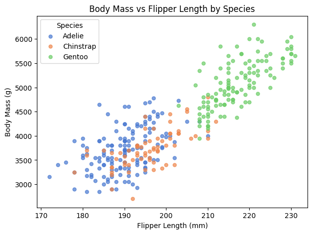
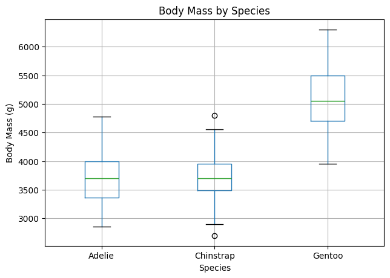
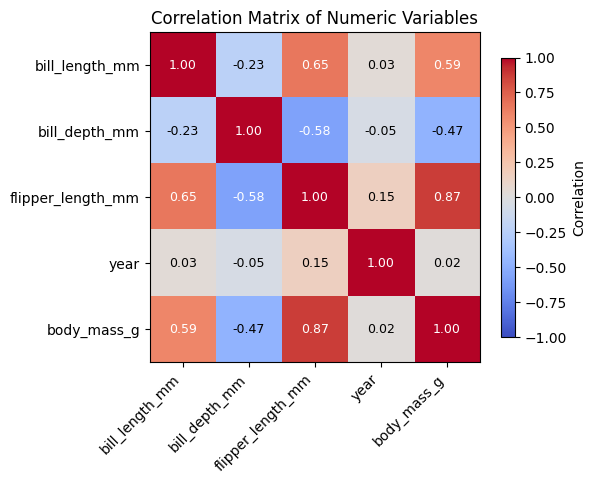

# Part 3. Explore, Prompt, and Build with GitHub Copilot

---

## Learning objectives

By the end of this workshop, you will:

- **Explore** a dataset with AI as your guide
- **Prompt** with intent to turn plain language into R and ggplot2 plots/code
- **Build** a habit of verification and code review

---

## Palmer Penguins dataset

To have something concrete to work with, we'll explore the **Palmer Penguins** dataset (`data/penguins.csv` in your Codespace) and build toward clear, colorful visualizations. It holds body measurements for penguins from three species across three islands — already in your Codespace, no download needed.

Here's a quick peek at the data:

| species | island | bill_length_mm | bill_depth_mm | flipper_length_mm | body_mass_g | sex | year |
|---------|--------|----------------|---------------|-------------------|-------------|-----|------|
| Adelie | Torgersen | 39.1 | 18.7 | 181 | 3750 | male | 2007 |
| Adelie | Torgersen | 39.5 | 17.4 | 186 | 3800 | female | 2007 |
| Adelie | Torgersen | 40.3 | 18.0 | 195 | 3250 | female | 2007 |
| Chinstrap | Dream | 46.5 | 17.9 | 192 | 3500 | female | 2007 |
| Gentoo | Biscoe | 46.1 | 13.2 | 211 | 4500 | female | 2007 |

**344 rows × 8 columns**

**Source:** [Palmer Penguins](https://allisonhorst.github.io/palmerpenguins/) · **Artwork:** [@allison_horst](https://twitter.com/allison_horst)

---

## How we'll work

The goal here isn't to write an analysis script — it's to make your **first visualization** by directing Copilot in plain language. You'll work in your Codespace using **`analysis.R`**, and there are really just two moves:

1. **Access the data** — load `data/penguins.csv` and get it ready to plot.
2. **Build a visualization** — create a plot with Copilot, then refine it in conversation until it looks the way you want.

We'll move through the data loading step together, then focus most of our attention on creating and refining your plot.

---

## Step 1: Access the data

**Goal:** Get the data loaded and ready to plot.

> *In `analysis.R`, add code to read `data/penguins.csv` with the tidyverse, drop rows with missing values, and save the result as `penguins_clean`. Print how many rows there are before and after.*

Run the code (**`Cmd/Ctrl + Enter`**), then **quickly check**:

- Did it read from `data/penguins.csv`?
- Did the row count drop a little once missing values were removed?
- Is the clean data stored as `penguins_clean` so your plots can use it?

That's it for setup — now the fun part.

---

## Step 2: Build and refine a visualization

This is where you'll go back and forth with Copilot. **You don't need to know ggplot** — you describe what you want, look at the plot, and ask for changes.

**Start simple:**

> *Using `penguins_clean`, make a ggplot scatter plot of `flipper_length_mm` (x) vs `body_mass_g` (y), with points colored by species.*

Here is an example of the kind of scatter plot you can get:

You'll get a basic plot, similar to the one above. Now refine it, one request at a time:

> *Add a clear title and axis labels.*

> *Use a cleaner theme — try `theme_minimal()`.*

> *Give each species its own color: Adelie `#4878d0`, Chinstrap `#ee854a`, Gentoo `#6acc65`.*

> *Make the points a bit larger and slightly transparent so overlaps are visible.*

Each request builds on the last. This is exactly how you'd work on your own projects: start rough, then steer the details — colors, labels, styling — until the result matches what you had in mind.

**This is the key skill.** Changing a color scheme, a label, or a plot type is just a sentence to Copilot. You focus on *what you want to see*; it handles the syntax. If you don't like a change, say so and try another direction.

**Then compare groups** with a second plot:

> *Add a box plot of `body_mass_g` by species, using the same colors.*

Here is an example of the kind of box plot you can get:

**Verify:**

- Does the scatter plot show a trend (longer flippers → heavier penguins)?
- Does the box plot show clear differences between species?
- Do the visuals match what you'd expect from the data?

### More plots to explore

Once you've got the basics, keep experimenting — each of these is just one more prompt, and a chance to see a different corner of ggplot:

> *Add a histogram (or density plot) of `body_mass_g` to see how weights are distributed.*

> *Turn the box plot into a violin plot to show the full shape of each species' distribution.*

> *Facet the scatter plot by `island` so each island gets its own panel.*

> *Make a bar chart of average `body_mass_g` per species, with error bars.*

> *Show a correlation heatmap of the numeric columns so I can see what's most related to body mass.*

A correlation heatmap, for instance, might look like this:

---

## Make it your own

Now try experimenting on your own with Copilot. Here are a few ideas to keep your exploration going:

- *"Color the scatter plot by `sex` instead of species — does the pattern change?"*
- *"Add a trend line to the scatter plot."*
- *"Make a plot that compares body mass across islands."*
- *"Explain what this code is doing, line by line."*
- *"Redo the plot so the colors are defined once and reused."*

---

## Resources

- [tidyverse documentation](https://www.tidyverse.org/)
- [ggplot2 documentation](https://ggplot2.tidyverse.org/)
- [Palmer Penguins dataset](https://allisonhorst.github.io/palmerpenguins/)
- [UBC AI guidance](../ubc_ai_policy.html)
