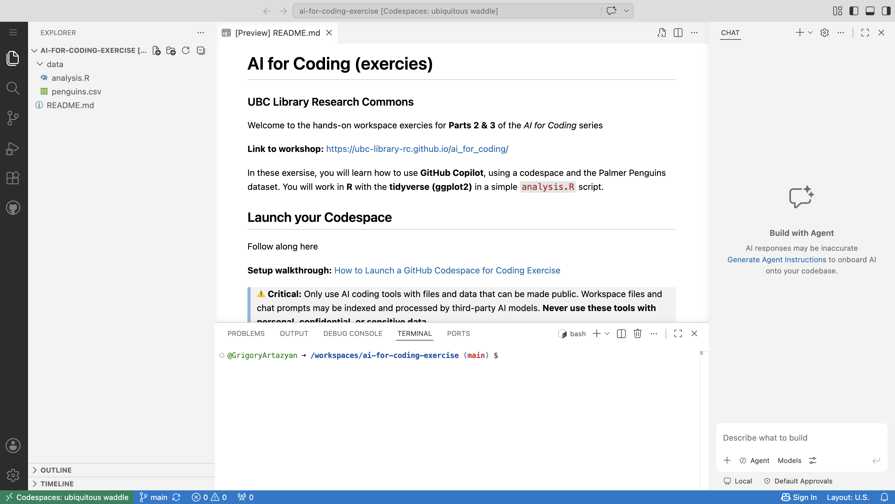
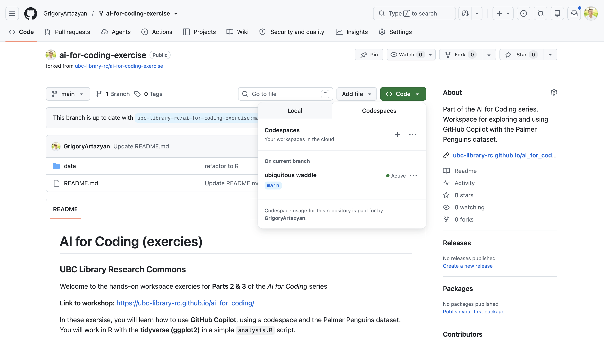

## GitHub Copilot: Codespace Setup

A step-by-step guide to forking the exercise repository and launching your Codespace.

---

Go to <https://github.com/ubc-library-rc/ai-for-coding-exercise/> and **sign in** to GitHub (top-right).

---

Click the **Fork** button near the top right, then choose **+ Create a new fork** (your own personal copy of the repository).

---

Leave all the default settings as they are and click the green **Create fork** button at the bottom right.

---

In a few moments, GitHub will finish making your fork. Once it's ready, the page refreshes automatically and shows that your new copy is complete.

---

Your own copy is ready — notice it now shows **your username** and *"forked from ubc-library-rc/ai-for-coding-exercise"* at the top.

---

Click the green **Code** button, switch to the **Codespaces** tab, then click **Create codespace on main**.

---

Your Codespace opens a full VS Code editor right in the browser — this is your coding environment for the workshop.

>Give it a minute to finish loading. A new tab will pop up with the Codespace.

---

To reopen your Codespace later, go back to your fork, click **Code → Codespaces**, and select your existing (green **Active**) Codespace.

